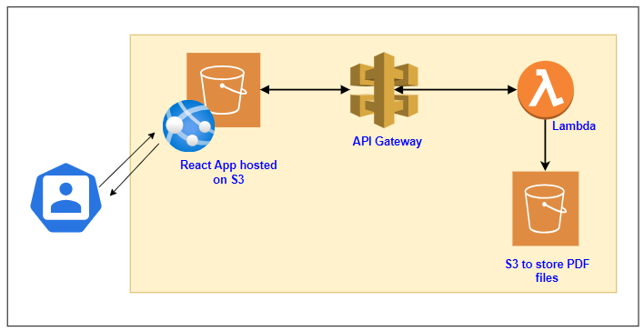
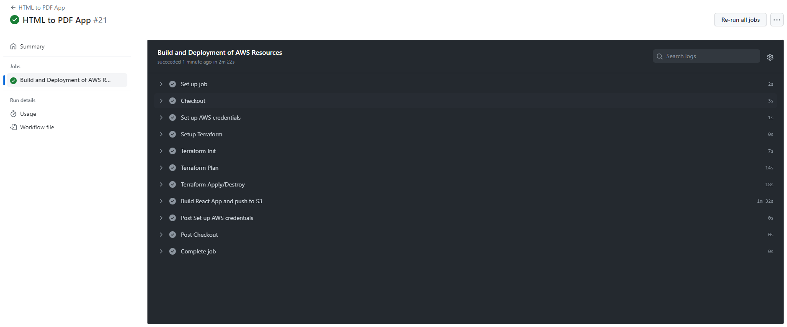
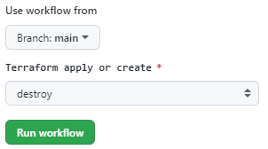
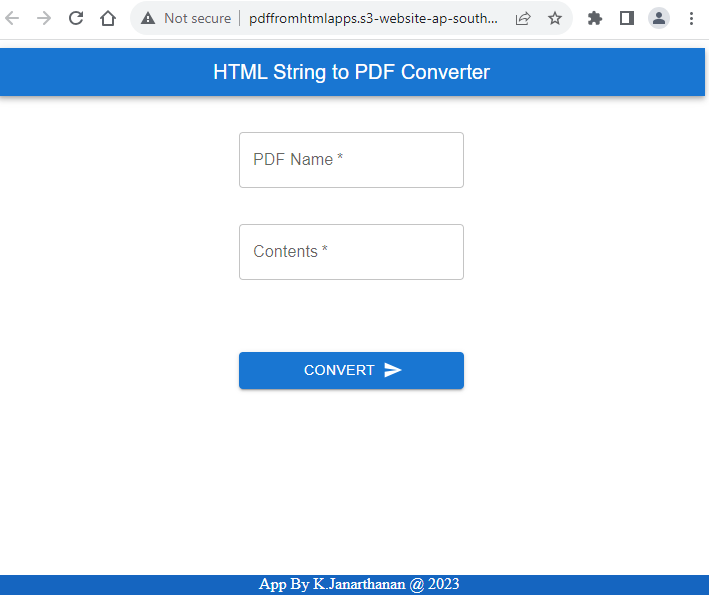
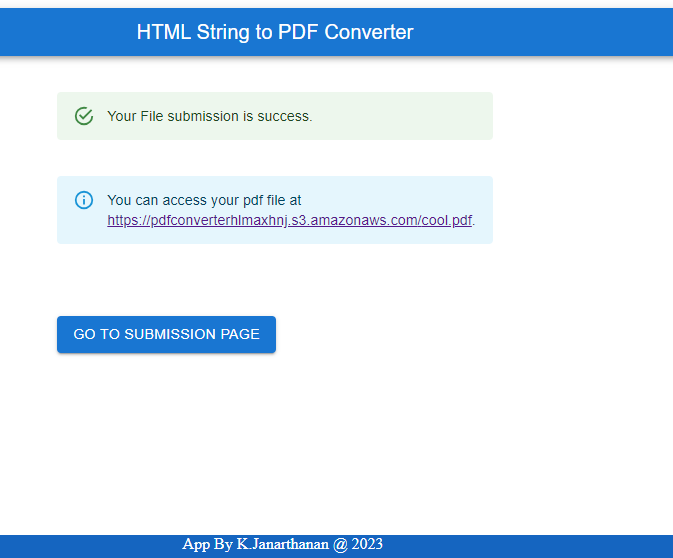

## Project
HTML to PDF converter app in AWS

## Resources Created
- S3 for Website hosting
- API GW
- Lambda
- S3 for PDF file storage

## Architecture 
<kbd>
  
</kbd>

## Features

1. Used to convert HTML string to PDF
2. Converted PDF will be stored in S3 and available for download with the link
3. CloudWatch logs to store the lambda logs
4. All Infrastructure is deployed via Terraform using GitAction pipeline
5. Frontend is made of React

## Pre-Requisites

1. Create a  __S3 Bucket__ to store the Terraform backend file and update the __provider.tf__
```terraform
terraform {
  backend "s3" {
    bucket = "gitactiontf"
    key    = "gittfstate"
    region = "ap-southeast-1"
  }
}
```

2. Create an IAM user with required privileges and download the accesskey id and secret access key

3. Create GitHub __Secrets__

<p align="center">
  <b>Secrets</b>
</p>

- **_AWS_ACCESS_KEY_ID_** : AWS Access Key ID
- **_AWS_SEC_ACCESS_KEY_** : AWS Secret Access Key

<kbd>
  
</kbd>

8. Fill the __terraform.tfvars__
```terraform
project_name     = "pdfconverter"
front_end_bucket = "pdffromhtmlapps"
lambda_file_zip  = "lambda_code.zip"
lambda_layer_zip = "wkhtmltox-0.12.6-4.amazonlinux2_lambda.zip"
apigw_stage      = "uat"
```

## Terraform Build
1. Go to GitHub -> Actions
2. Select the Branch and Apply

<kbd>
  
</kbd>

<p align="center">
  <b>Pipeline</b>
</p>

<kbd>
  
</kbd>

## Terraform Destroy
1. Go to GitHub -> Actions
2. Select the Branch and Destroy
<kbd>
  
</kbd>

## App 

1. Front end
<kbd>
  
</kbd>

2. After conversion
<kbd>
  
</kbd>